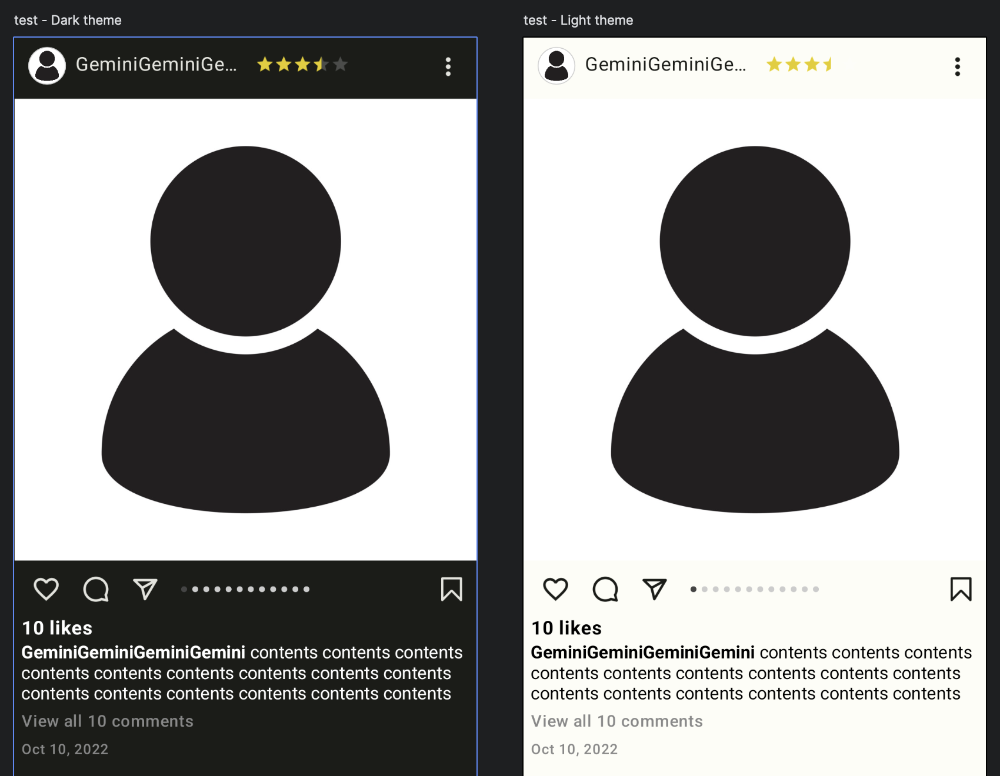

# BaseFeed Module

메인 화면, 프로필 화면 등 다양한 화면에서 사용할 수 있는 피드 UI

## How to use


```
dependencies {
	implementation 'com.github.sarang628:BaseFeed:6307ce6df9'
}	
```

```
/**
 * Feed 항목
 * @param review 리뷰 데이터
 * @param isZooming pinch zoom 여부
 * @param progressTintColor ratingBar 색
 * @param favoriteColor 즐겨찾기 색
 * @param onImage 이미지 클릭
 * @param onProfile 프로필 클릭
 * @param onLike 좋아요 클릭
 * @param onComment 코멘트 클릭
 * @param onShare 공유 클릭
 * @param onFavorite 즐겨찾기 클릭
 * @param onMenu 메뉴 클릭
 * @param onName 사용자명 클릭
 * @param onRestaurant 음식점명 클릭
 * @param onLikes 좋아요 클릭
 * @param imageLoadCompose 공통 이미지 compose
 */
@Composable
fun Feed(
    review: Review,
    isZooming: ((Boolean) -> Unit),
    progressTintColor: Color = Color(0xffe6cc00),
    favoriteColor: Color = Color(0xffe6cc00),
    onImage: ((Int) -> Unit),
    onProfile: (() -> Unit),
    onLike: (() -> Unit),
    onComment: (() -> Unit),
    onShare: (() -> Unit),
    onFavorite: (() -> Unit),
    onMenu: (() -> Unit),
    onName: (() -> Unit),
    onRestaurant: (() -> Unit),
    onLikes: (() -> Unit),
    imageLoadCompose: @Composable (Modifier, String, Dp?, Dp?, ContentScale?) -> Unit,
)
```

## Feature

- Jetpack Compose
- Dependency injection with Hilt
- Compose ConstraintLayout
- Localization
- ExpandableText

## functional Requirement

- 공통 콘텐츠 항목
    - 사용자가 업로드 한 feed(review) 를 list item 으로 보여 준다.
    - 다른 모듈에서 사용할 수 있도록 모듈화 한다.
    - 리스트를 당기면 갱신한다.
    - 리스트가 하단에 닿으면 다음 항목을 불러온다.

- 좋아요 및 즐겨찾기:
    - 사용자는 포스팅에 좋아요/즐겨찾기를 누를 수 있어야 한다.

- 게시물 관리:
    - 사용자는 자신의 게시물을 삭제/수정, 다른 게시물을 신고 할 수 있다.

## convention

### package

- compose로 구현한 UI는 compose 패키지에 저장
- uistate는 uistate 패키지에 저장
  

## Architecture

### UI element

[Feed.kt](./library/src/main/java/com/sarang/torang/compose/feed/Feed.kt)
[Feeds.kt](./library/src/main/java/com/sarang/torang/compose/feed/Feeds.kt)

### UI layer

UiState

```
sealed interface FeedsUiState {
    object Loading : FeedsUiState
    object Empty : FeedsUiState
    data class Success(val reviews: List<Review>) : FeedsUiState
    data class Error(val message: String) : FeedsUiState
}
```

## Unit test

- 최초 로딩 중일 때 리스트가 나오면 안된다.
- 최초 로딩이 되었고 리스트가 비어있다면 리스트가 비어있음을 표시한다.
- 최초 로딩이 되었고 리스트가 있다면 리스트를 표시한다.
- 

## 화면


## Update
gradle.build.kts 로 변경