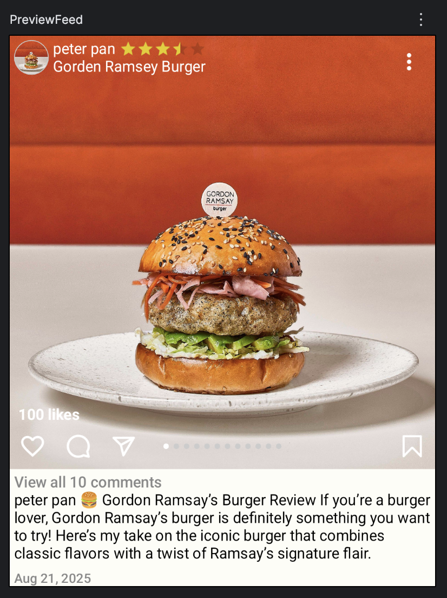

# BaseFeed Module

다양한 화면에서 사용할 수 있는 Feed 모듈

# Preview


## How to use


```
dependencies {
	implementation 'com.github.sarang628:BaseFeed:{refer to jitpack}'
}	
```

```
@Preview(showBackground = true, backgroundColor = 0xFFFDFDF6)
@Composable
fun PreviewFeed() {
    FeedItem(/* Preview */
        uiState = FeedItemUiState.Sample
    )
}
```

## Feature

- Jetpack Compose
- Dependency injection with Hilt
- Compose ConstraintLayout
- Localization
- ExpandableText

## convention

### package

- compose로 구현한 UI는 compose 패키지에 저장
- uistate는 uistate 패키지에 저장
  

## Architecture

### UI element
[UIElement](/documents/UIElement.md)
[FeedItem.kt](/library/src/main/java/com/sarang/torang/compose/feed/FeedItem.kt)

### UI layer
[UIState](/documents/UIState.md)
[FeedItemUiState.kt](/library/src/main/java/com/sarang/torang/data/basefeed/FeedItemUiState.kt)

[StateHolder](/documents/StateHolder.md)
[FeedListViewModel](app/src/main/java/com/sarang/torang/compose/FeedListViewModel.kt)

## development note
- gradle.build.kts 로 변경
- FeedItem 으로 이름 변경 및 constraint layout 적용 (250821)