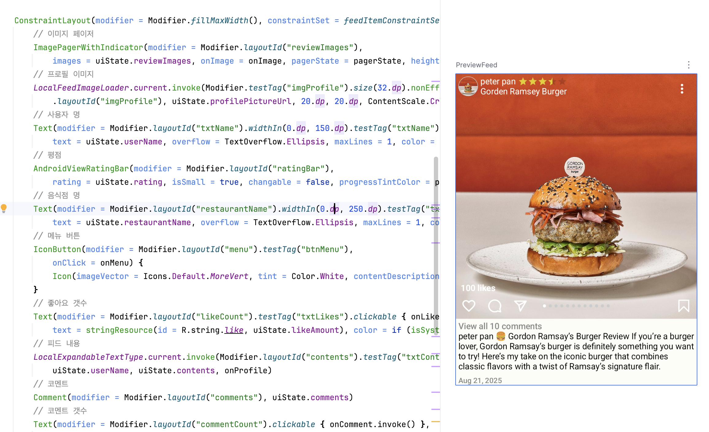

피드 항목은 요소들이 많아 어떻게 하면 가독성, 관리하기 좋은 코드를 만들 수 있는지 고민해봤다.

## Row, Column을 사용. 상단, 중앙, 하단으로 나눠 구현

피드 항목을 3개로 나눠서 한번에 모든것을 구현하는 부담을 줄여 보았다.

compose 함수 4개 미리보기 함수 4개 총 8개의 함수가 만들어져 한 파일에 함수와 라인 수가

너무 많아 보여 다른 방법을 시도해 보기로 함.

-> 다시 이 방법으로 돌아옴. ConstraintLayout은 compose에서 구현하기 불편한 점이 있었다.
 - xml 방식에서는 drag&drop 방식으로 각 UI 요소가 xml에 어디 위치해 있는지 중요하지 않았다.
 - 컴포즈는 composable drag&drop를 지원하지 않아. UI요소를 일일히 신경쓰며 구현해야하는 불편함이 있었다.
 - 이는 나중에 UI 수정 등 유지보수 하는데에도 어려움이 있어 기존 방식으로 돌아가기로 결정.

## ConstraintLayout 사용

XML ConstraintLayout은 drag&drop 으로 편리하게 UI를 구현할 수 있었는데
Compose ConstraintLayout은 그렇지 않다.

Row와 Column을 중첩으로 하더라도 XML의 LinearLayout이나 RelativeLayout을 중첩하면 발생하는
비효율을 개선해 궂이 ConstraintLayout을 사용할 필요가 없다.

하지만 나에겐 ConstraintLayout을 사용하는게 가독성 측면에서 좋아보였다.

하나의 함수에 모든 요소를 중첩없이 배치 할 수 있어

모든 요소를 같은 레벨에서 볼 수 있다.

ConstraintSet()을 배치 기능만 명확하게 분리할 수도 있다.

## ProfileTop
Compose UI를 구현하는 예제로 사용하기 좋은 Composable 이다.

Composable의 주요 특징을 생각해보며 구현했다.

composable의 특징

UI of an app is what you see on the screen

Jetpack Compose is a modern toolkit for building Android UIs. Compose simplifies and accelerates UI development on Android with less code, powerful tools, and intuitive Kotlin capabilities.

- Describes some part of your UI.
- Doesn't return anything.
- Takes some input and generates what's shown on the screen.

Annotations are means of attaching extra information to code.
Annotations can take parameters.

Jetpack Compose is built around composable functions.
Composable functions can accept arguments, which let the app logic describe or modify the UI.

MUST be a noun: DoneButton()

